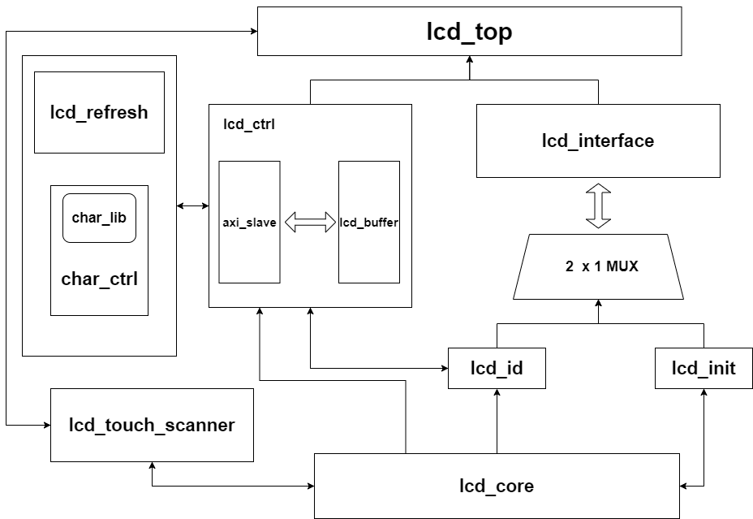

# peripheral

## 一、IP核
 * AXI Crossbar IP
 > 用于实现AXI 1 to 2的转换，使AXI总线能够同时连接confreg和LCD，注意Base Addr用来决定外设的地址
 [参考资料](https://blog.csdn.net/canchen0720/article/details/122078978?spm=1001.2014.3001.5506) 
 * AXI Interconnect RTL
 > 用于实现AXI 128 到 32的转换

## 二、拓扑图
*  SOC结构
   
* LCD的控制流程

* LCD的模块示意图
  
  > 1. lcd ctrl是LCD控制器的控制逻辑模块，用来接受CPU的AXI信号，与总线进行握手，并且内置译码器，将AXI的信号翻译为LCD模块的控制信号。生成的控制信号用来控制更新接口中寄存器的值。并将接口中的信号翻译为AXI信号，实现CPU和接口模块的交互效果。可以借鉴一下样例代码的控制器IP核。lcd_ctrl中内置lcd_buffer
  > 2. lcd interface 是与LCD直接相连的接口，里面提供了一堆能够供CPU和LCD直接访问的寄存器。CPU通过sw或lw读写该模块的寄存器，接口根据CPU的命令和寄存器的值向LCD发出命令
  > 3. lcd_id是译码器，用来翻译wdata的数据，向lcd_interface传送命令
  > 4. lcd_init 是lcd的初始化模块，用来用来实现LCD硬件初始化，只有LCD实现硬件初始化后才能正常的运行LCD控制器。内部同时集成了开机的初始页面。开机后会先显示一个HIT的LOGO
  > 5. lcd_mux  是lcd的选择器用来实现lcd_id和lcd_init的二选一
  > 6. lcd_touch_scanner 触屏模块，参考UltraMips的触屏模块。可以直接当作IP核来用
  > 7. lcd_refresh 刷新模块，用来刷白屏,覆盖之前的绘图
  > 8. char_ctrl 字符控制器，根据从char_lib中获取到的字符点阵发送每个像素点的rgb值到lcd_ctrl，从而完成字符绘制。需要注意和lcd_ctrl的握手
  > 9. char_lib 字库，根据用户输入的ASCII码（32~128）从bram中读取一个24*40的字符点阵
  > 10. lcd_core LCD的控制中心，用来判断LCD目前处于什么状态，决定LCD要显示什么内容。
  > 11. lcd_test_ctrl 无AXI总线的lcd_ctrl用来测试

## 三、基本的设想
  * 为了尽可能少的修改SOC，新增的外设采用和confreg相同的地址空间，在confreg中没有使用到的地址用于实现新增的外设。估计需要16字节的地址  
  
  * 采用IP核来设计LCD控制器 

## 四、可能用到的参考资料
* UltraMips完整版——位于实验室的电脑上面

* 团队赛的资料包中的上板测试

* LCD说明手册
    1. 注意查看信号引脚的要求

* 小学期课程指导书

* 外设文件夹下面的论文和网上收藏的两篇博客

* 看confreg的逻辑重点看AXI信号的握手，和led灯以及switch的控制
    1. 一个s_wdata中包含的是8个数码管的数字，每个数字是4位的

* 官方LCD的控制器一定要看。
    
  
## 五、任务完成情况

- [X] 阅读完基本资料(学长的经验总结，答辩文档，小学期外设知识点)
- [X] LCD说明书
- [X] 搜集到的多篇论文，2篇博客 
- [X] 阅读完团队赛的上板代码
- [X] 搞清楚confreg的逻辑
- [X] 熟悉SOC的基本架构
- [X] 阅读完学长的两份代码
- [X] 写lcd ctrl模块完成与AXI的握手和翻译
- [X] 写lcd interface模块完成完成与CPU和LCD的交互，实现CPU控制LCD
- [X] 手动编写测试代码，使数码管的灯亮起来

## 六、外设寻址
* 地址空间

    1. 基地址:采用和confreg(数码管，拨码开关)一样的基础地址`1fd0_xxxx`

    2. 地址偏移量:用来决定外设接口中的寄存器地址的，决定应该写或读哪个寄存器。在接口中应该根据地址偏移量和axi总线的信号来决定应该怎么操作外设。目前好像对于地址没有什么特别要求，只要32位对齐就好。计划从1fd0_c000开始作为LCD好外设的地址

    3. 进行外设的操控需要写C或是汇编代码。其中要用循环语句反复监听接口中寄存器的变化。简单来说现在就是一个程序查询方式的访问外设的方法。想用外设就需要不断的监听外设的寄存器的情况。基本的处理思路是如下  
   
        - [ ] cpu先从输入接口里面读数据，例如拨码开关
        - [ ] cpu再向输出的接口中写数据，例如数码管或是LCD灯

* CPU与外设进行交互的原理

    - 通过接口连接CPU与外设
    - CPU通过SW写接口的寄存器，接口根据寄存器的值改变外设的控制信号(本质上是更新外设要读取的寄存器的值)。外设读取相应寄存器的值，实现相应功能
    - 外设改变寄存器中的值，CPU每隔一段时间读取接口中寄存器的值（在高级语言中表现为一个while循环），CPU根据读到的数据决定后续的操作

## 七、问题和概念

* 不同设备的时钟频率可能不同，这个需要后期的调整:读和写的时序是有要求的，写的时钟周期时33ns，读的时钟周期是400ns，想要成功的向LCD写入数据和指令，或是读取数据和指令，使能和数据信号的拉高或是拉低是有时间要求的。由于读的时钟周期太长了，所以一般频率都是以写的时钟周期为准，这样可以快点。建议一个时钟周期33ns或是30ns。最少也要15ns不然数据写不出去。写的时候wr为0时，data要保持15ns，wr为高时，data还要继续保持15ns，之后才能进行复位。具体的看说明书的时序图。本LCD的设计采用20ns

* 一些不太懂的点
    - [ ] 1. 硬件加速:让硬件在不需要CPU控制的情况下尽可能多的能够自动完成某些动作。CPU发送少量的命令，硬件能够移动解释并拓展这些命令，执行相应的操作，而不需要CPU每发一条指令，硬件执行一个动作。实现硬件加速的基本做法
  
        * CPU一次性把要操作外设的指令发送到外设，外设用buffer将指令存起来
        * buffer满后，外设不再接受CPU发送的新指令，直到外设自动将buffer里面的指令处理完毕。此时CPU仍然可以去访问其他外设。
        * 硬件加速的好处的优势:假设cpu操作外设需要6条sw指令，每条sw指令传送到外设5s，外设执行完指令需要5s，如果不使用硬件加速，完成一次外设的操作需要6*（5+5）s;如果采用硬件加速，一次性将6条sw发送到外设，需要5s*6=30s,之后外设自动读取buffer里的命令，此时CPU还可以操作其他的外设，采用硬件加速后60s内可以同时操作两个外设，当需要操作的外设越多时，硬件加速的效果越明显。
    - [X] 2. 16位8080并口:Intel规定的16位总线接口，要用inout来声明
    - [X] 3. 外设与cpu之间的时序关系
    - [X] 4. LCD的命令和参数之间有什么关系吗？:控制LCD的方式一般为1.先传命令2.再传相应的参数(参数个数可能为多个)。命令和参数都是16位，通过16位的双向数据总线（8080并口）传送命令和数据。通过RS，RD，WR来区读写命令和数据。RS为0命令，为1数据
    - [X] 5. LCD的显示和触摸好像是两个不同的模块：显示和触摸是两个不同的模块，可以分开设计，不过顶层接口是一样的。可以把这两个模块理解为icache和dcache。
    - [X] 6. 要怎么通过指令读取LCD里面相应的寄存器，好像也没有地址？:LCD中的寄存器的位置都是固定的，直接发送指令过去就能够读到相应的值。
    - [X] VGA和LCD的区别和作用
        > * VGA:接口用来传图片的，相当于台式机中显示屏和主机的连接线
        > * LCD:显示屏，实现输入和输出的终端。显示画片，捕获触摸，相当与电脑中的显示器
    - [X] GRAM:LCD中的内存，是像素矩阵的数据缓存，控制它就是控制液晶屏上面的画面。和显存差不多
    - [X] lcd_bl_ctr背光引脚控制，用来干什么？:LCD不会发光，靠LCD的背光灯照亮LCD屏幕，要想有图像只能让背光灯亮。所以只要LCD工作(不复位)就拉高就完事了。lcd_bl_ctr为1时灯亮
    - [X] LCD如何初始化?
    ```
       LCD的初始化是对LCD控制IC初始化。
    _____________________________________________
       如果是单片机控制LCD显示时，单片机电路一般都会上电复位或硬复位，这样就可以完成单片机系统电路的初始化操作。
       但单片机的初始化对LCD没有影响。LCD本身也有控制器，即要对IC也要进行初始化操作。
       例如：假设当我们开机时LCD显示“你好”。系统运行过程中突然复位，这个时候假如LCD显示“北京”。
       单片机复位后应该显示“你好”才对，但可能LCD还显示“北京”。这个时候就要对LCD进行复位，就可以显示正常了。
       LCD初始化是为了保证按下rst复位键后，屏幕显示的内容也会跟着初始化；LCD只是个显示器，不带存储功能，在初始化的过程中要进行相关的配置，就像电脑开机要先执行rom里面的开机执行程序一样
    ```
    LCD初始化需要用运行专门的代码，这部分的代码由LCD厂商提供。显示和触屏都需要初始化
    - [X] LCD需要加一个译码器电路吗


## 八、参考文献
  1. 王新宁.基于FPGA的LCD控制器模块设计探讨[J].农家参谋,2020(12):267.
  2. 陈东成,胡敬营,曾范昌.LCD控制器的FPGA实现[J].电子器件,2017,40(05):1115-1120.
  3. 王春雷,姚洁.一种基于FPGA的LCD控制器设计[J].自动化应用,2016(11):63-65+71.
  4. 豆瓣电科大本科生的毕业论文
  5. [CSDN博客](https://blog.csdn.net/special00/article/details/78128397?utm_term=TFTLCD%E5%88%9D%E5%A7%8B%E5%8C%96&utm_medium=distribute.pc_aggpage_search_result.none-task-blog-2~all~sobaiduweb~default-3-78128397-null-null&spm=3001.4430)


## 九、LCD设计要点
* 坐标的设置
    1. 通过相应的指令设置x坐标的取值范围（SC和EC）
    2. 通过相应的指令设置y坐标的取值范围(SP和EP)
    3. (SC,SP)就是初始的坐标
    4. 坐标的设计需要用到4个15bit的寄存器，用来记录SC，EC，SP，EP
* 扫描方向的设置
* CPU读的是接口中的寄存器，不需要读LCD中的寄存器。如果CPU想要获取LCD中寄存器中的信息可以通过sw先更新接口中的命令寄存器，然后向LCD中传送读寄存器的命令，LCD读到寄存器后再把数据传到接口保存到相应的寄存器当中。CPU直接读这个寄存器就好。
   
    1. CPU用sw指令更新接口中命令寄存器
    2. 接口根据命令寄存器的值和AXI总线的信号向LCD发出读寄存器的指令
    3. LCD读出的寄存器值返回到接口，更新接口的相应寄存器
    4. CPU通过lw指令读取接口的相应寄存器的值，获得LCD的信息
* CPU控制外设。CPU通过sw指令更新接口寄存器中的值，控制器再根据寄存器的信息更新输出给外设的寄存器中的值
    1. CPU通过sw指令写接口寄存器(这些寄存器是32位的)
    2. 控制器更新外设要读取的寄存器的值
    3. 外设读到寄存器，外设状态发生变化

* 接口中供CPU直接读写的寄存器的位宽应该都是32位，与外设相互交换的寄存器和与CPU相互交换的寄存器是不一样的
* LCD控制器的接口采用和官方示例代码同名的接口
* 可能需要用到一个叫做display_valid的变量控制LCD的操作 
* 加快读和写LCD的速度
    1. 参考UltraMIPS，接口不断的监听LCD屏幕中触摸点的坐标，CPU获取坐标时只需要直接从接口都就好，不需要重新发送指令
* 寄存器的设计
    1. 一个输出寄存器用来给LCD传信号，负责存储wdata。LCD 输出寄存器:1fd0_c008
    2. 一个输入寄存器，存储LCD输入的数据。（保存读指令的数据）LCD的输入寄存器:1fd0_c000
    3. 一个触屏的寄存器,存储触屏输入的信息。LCD的触屏寄存器:1fd0_c004
    4. VGA绘制信息寄存器1fd0_c008
* 图片绘制所需要的信息
  1. 设置坐标
  2. 设置扫描方向
  3. 设置颜色
  4. 设置图片
* lcd_data_io[15:0]在顶层模块进行初始划分，分为data_i和data_o，其中需要加一个data_write_ctrl来判断data是否为data_o.data_o不输出是判定为高阻态
* 接口的读写状态机
* LCD的读写时序
* 读数据在rd拉高后5ns内无效的,这个要怎么处理呢？


## 十、AXI从机信号的设计
## 10.1 读状态机
  * arready在握手前都一直拉高，和awvalid握手后立刻拉低，直到bvalid拉高时再拉高
  * rvalid当读到数据后拉高，同时和数据一起给到AXI，等到rvalid和rready握手后再次拉低,此时所有数据复位
  
## 10.2 写状态机
 * awready在lcd 空闲可写时，和awvalid握手后立刻拉低，直到bvalid拉高时再拉高
* wready和wvalid握手时表示接收到写数据
* bvalid拉高表示数据和地址到lcd id模块，并被存起来了，接下来AXI一次写周期结束
* 换种思路，写状态机中只有在接口空闲时才能，即LCD inteface的状态机不工作时才能接受AXI的请求，而不是写完后再把bvalid拉高，这样能尽可能的提高CPU与外设的并行性。
* 由于涉及到128 to 32,所以wstrb需要用来判断是否写

## 十一、C编写的规范
* 用volatile关键字声明地址和要写入外设接口的变量。volatile的作用是防止编译器优化变量   

    ```C
        //有volatile
        volatile int led;
        led=0xffff;//16个led灯亮
        led=0x1;//1个led亮
        //led先亮16个，再亮1个

        //无volatile
        int led;
        led=0xffff;//被编译器忽略
        led=0x1;//1个led亮
        //led灯亮1个，不会出现亮16个的情况
    ```
* 指定的外设地址参考记忆游戏的编写，直接用宏定义

    ```C
    #define LED_ADDR                0xbfaff000//led灯外设的地址

    #define SOC_LED            (* (volatile unsigned *)  LED_ADDR      )//SOC_LED就是awaddr为bfaf_f000的地址的wdata
    ```
* C中操作lcd的基本代码格式(猜测版)，以设置扫描方向为例,一次性把指令和参数全部传完在CPU内部自己切割
    ```C
    # define W_ADDR                 0x1fd0c008
    # define WDATA           (* (volatile unsigned *)  W_ADDR)

    //先写指令
    WDATA=0X3600_0080    //0x3600是设置扫描方向的指令，0x0080是参数，表示扫描方向为从左到右从上到下

    //再设置坐标
    WDATA=0x2A00_ffff //设置x的下界,2A00，2A01是指令;ffff是参数


    WDATA=0X2A02_ffff  // 设置x的上界,2A02,2A03是指令;ffff是参数

    //y做标配的设置同理

    //接着再设置颜色
    WDATA=0x2C00_xxxx//不知道这怎么设置待会再说，直接看外设文件夹下的相关

    //最后设置图片得大小
    WDATA=0x05DC_00ff  //ff用来标明传得是图片得大小，5DC00表示图片的大小
    ```

## 十二、lcd_id模块

    该模块是译码模块，用于将AXI的wdata翻译成LCD的指令和参数，之后控制LCD进行读写操作
## 接口的含义
### from/to lcd interface
*  busy：lcd interfacce正在工作，如果lcd interface正在工作，则lcd_id保持当前的状态，无法进行新的译码，不能向lcd interface传入新的数据。当busy=0时lcd id才能进行译码

* 发送busy后不管发生什么事情都需要先暂停一周期，因为interface还没有启动

* wr:0表示读指令，1表示写指令，用来区分指令的类型，从而控制接口状态机的跳转

* we:写使能，高位有效，we为高时，表示要向lcd写入数据，用来启动接口状态机，即让接口状态机从复位状态跳转到其他状态。

* data_o:输出到lcd的指令或数据，16位。一般情况下是先输指令在输出数据

* 译码处于IDLE状态表明已经写完和读完了，AXI从机可以接受新的数据了

* id_fm:用来判断读的类型。interface根据id_fm决定读延迟

* read_color_o:interface用来判断是否读颜色，如果读颜色那么那么需要连续读两次

## 延迟lcd_ctrl 的输入信号一周期
延迟的目的是把lcd_ctrl的数据和地址存放到缓存后，在进行译码，保证AXI的握手与写LCD是相互独立的，实现了硬件加速

## 采用状态机进行译码
* 不同的指令译码状态不一样，以设置扫描方向的指令为例
    1. 状态机处于IDLE状态等待输入
    2. IDLE接收到lcd_ctrl的写请求和数据，跳转到SCAN_INST状态进行译码，输出指令
    3. SCAN_INST状态下当lcd_interface不忙时跳转到SCAN_DATA进行参数的译码，输出参数。
    4. SCAN_INST当lcd_interface不忙时跳转到IDLE等待新的输入

## 十三、lcd_interface模块
## to lcd_id
* busy:一旦接收到we立刻拉高busy，直到写完时再把busy拉低。写完时拉低一个时钟周期。表现为next_state为IDLE拉低。为保证时序，busy在组合逻辑中拉低.
## to lcd
* 代码中有注释
 
## 读周期和读次数
## 状态机的设计
* IDLE:复位状态
* SETUP_WRITE:写设置状态。用来拉低wr，设置data_o,根据说明书，wr和data_o的初始化时间最少15ns
* WRITING:写状态。将数据写入lcd中。wr拉高，data_o还是保持输出。此状态至少持续15ns
* SETUP_READING:拉低rd，读数据，此状态有时序要求，需要保持多周期，ID保持45ns，FM保持250ns
* READING:拉高rd，读完数据，ID保持90ns,FM保持250ns

## 十四、VGA的作用
* VGA用来将图片和视频转化成rgb信号，LCD自带VGA接口。如果没有VGA想要显示像校徽这样的高精度图片，你需要一个像素点一个像素点的画出来
  
* 实现的要求：实现vga_r,vga_g,vga_b(重点)，还有行列的控制信号

* VGA的作用是以rgb的形式传送图像显示信息，他是用来控制电脑（台式机）的显示屏的图像显示的，不是控制lcd的。实现了VGA后，能够通过开发板控制台式机的电脑屏幕的显示，相当于把电脑的显示屏当成外设，板子当成主机

## 十五、 一些加速的想法
* 对于绘图操作可以增加一个缓存。在lcd_id之后增加。这样使得AXI不需要等到之前的数据完全写进去后才能接受新的写请求。由于画一幅图需要6个sw指令，如果每把一个sw指令写进去后才能继续接受下一个sw指令那么相邻两个sw可能会间隔较长的时钟。

* 或许根本不需要在lcd_id后面增加缓存，因为从AXI接收到数据到把数据写出去最多也就20个时钟周期，信号说不定还没有被传回axi。当然考虑到CPU的频率是外设的2倍，可能已经传到了

* 一次性接受完6条sw指令，然后在同一个时钟周期一次性把六条指令译码完毕，接着按顺序把6条指令译码出的LCD指令和参数写进去。可以在lcd_ctrl后面加一个缓存,然后存取6条连续的sw，存完后再进行译码和写LCD的操作。写完后再允许AXI接受新的指令。原本的id仍然可以用，因为这个东西就相当于是一个译码和LCD指令派发逻辑的结合

## lcd_buffer
lcd_buffer是一个指令缓存,用来存储axi的sw指令，当然只是专门存储绘图指令，读指令和VGA指令都是只有一条，不需要存储。对于绘图需要存储连续6条指令，以保证绘图的信息完整。

* 实现了lcd_buffer后就可以将绘制图片完全交给硬件来操作，cpu不必参与其中，从而实现硬件加速

* 工作原理
   1. AXI传送绘制图像的信息，传送连续六条sw指令，lcd_ctrl中内置buffer把六条sw指令存储起来
   2. 当buffer满后，说明可以开始绘制图像，此时lcd_ctrl不能接受新的写请求。
   3. 将buffer中的6条sw指令一条接一条的发送到lcd_id,完成译码，并最终通过lcd_interface写入lcd
   4. 当buffer为空时,lcd_ctrl可以重新接受新的写请求，buffer接受新的绘图信息

## 十六、图像绘制
* 绘图的原理:每条2c00指令只能画一个像素点的颜色，要想画满整个矩形，必须要连续写入颜色才行，一个像素点没什么用。注意必须要连续写入颜色信息直到将矩形完全填满才行，否则不会显示颜色

* 屏幕的大小是480(x)*800(y),坐标原点在哪根据扫描方向制定

* 动画效果要怎么实现，是按帧绘制的吗。绘制的原理是一张图片覆盖在另一张上面，还是先清空再重新绘制？

* 哪些动作由CPU操作，哪些动作由硬件操作:1.固定的东西由硬件控制 2.变化的东西由CPU控制

* 需要整一个专门的数据来记录画图时图像的大小。所以画图一共是7条sw：设置扫描方向*1，设置边界*4，设置颜色*1，设置大小*1,一共7条


## 图片显示到LCD上面

1. 用格式工厂或是window自带的画图将图片转为BMP（24bit）格式
2. 使用正点原子的转化软件将图片转为rgb565格式的coe（16bit）
3. 设置扫描方向为3600  0000（从左到右，从上到下）
4. 设置坐标的范围，坐标的范围一定要和图片的像素完全对齐，不允许出现任何的误差，否则图片的显示会有较大的偏移。比如200 * 199的图片不能因为图方便把LCD的坐标设置为200 * 200
5. 把coe存入bram，然后正常的绘图即可

## 十七、lcd_init

* 用来实现初始化页面，主要的内容由1.开始页面的初始化  2.选择页面的初始化  3.游戏页面的初始化

* 初始化的流程:1.清屏(设置背景颜色) 2.从bram中取出内置好的初始化代码一条一条的发到lcd_interface当中


## 十八、lcd_refresh
内置的背景刷新模块，ctrl向lcd_refresh请求拿到数据后，将数据送往lcd_interface，此过程需要用到10个时钟

* 一种加速的想法是refresh的数据不用经过lcd_ctrl，直接送到lcd_interface就好，当lcd_refresh送完数据后再直接告诉lcd_ctrl刷新完毕这可能比较好点

## 十九、关于lcd初始化

* lcd想要显示或是触摸都需要执行初始化代码，这一点很重要。如果没有进行初始化，那么会一直白屏，触碰也不会有效。初始化代码不需要直接写，由厂商提供，在运行lcd前，将初始化代码写入lcd即可。初始化代码的执行和正常的lcd指令一样，可以参考lcd_init下面的代码.

* peripheral/initial_coe中包含了图片显示的coe文件，其中HIT.coe是开机本队伍开机LOGO的代码，该文件的前786行是通用的lcd显示屏初始化代码;lcd_init.coe是lcd初始化代码，只有把这个文件里面的代码写入lcd，才能让lcd开始工作；tp.coe是触摸屏代码只有把tp.coe的代码写入lcd中，才能开始触摸，tp.coe在lcd_touch_scanner中执行

  
## 天坑

* 组合逻辑不要存在环路，不然敏感信号列表会被直接优化掉

* 组合环路一定要小心，如果上板和仿真的波形对不上注意一下组合环路和锁存器

* 指令和参数一定要写对，一定要符合规范。扫描方向和坐标的设置时强耦合的

* LCD在启动前必须要先执行初始化，初始化的代码是用来初始化硬件的，这部分代码不需要自己写，需要由厂商提供

* 初始化代码的最后一条2900执行前需要暂停40000*30ns,对于前面764初始化指令（地址0~763）技术指令是命令，rs为0，偶数指令是数据rs为1

* 图片绘制需要注意坐标的范围要和图片的长和宽完全一致，不然画出来的图片会飘

* 触摸模块如果需要连续触摸注意增加消抖模块
